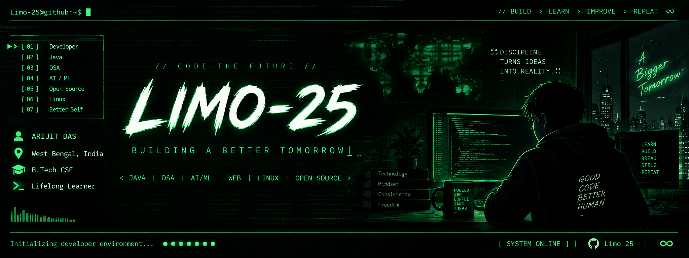
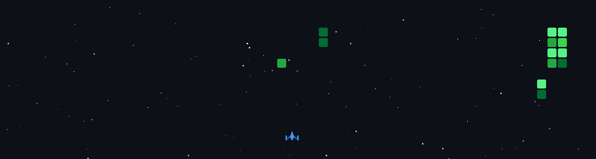
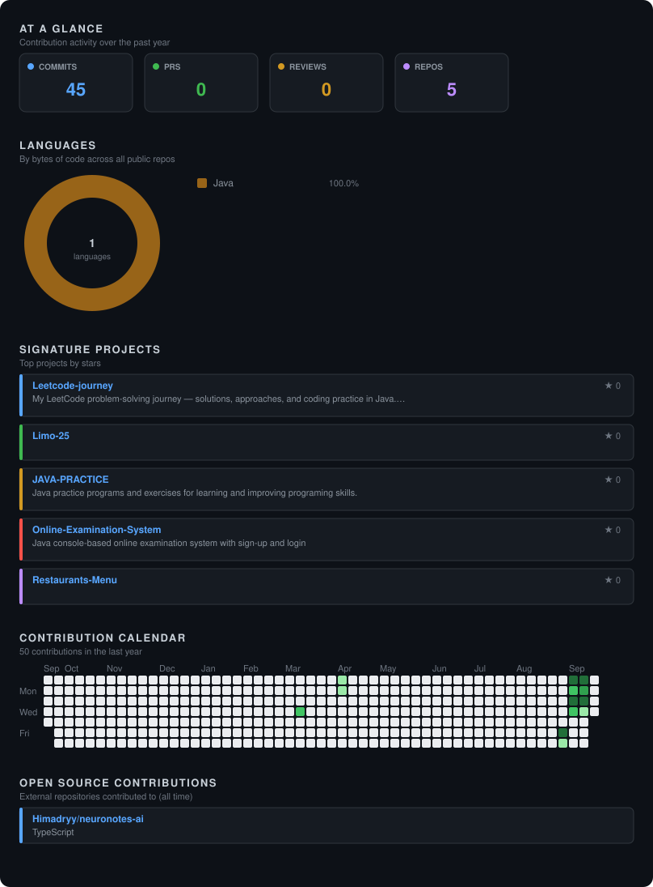

<div align="center">



</div>

<div align="center">


</div>

<div align="center">


</div>

<br>

<div align="center">


<br>


</div>

<div align="center">

</div>

## 🪪 `OPERATIVE ID CARD`

<div align="center">



</div>

<div align="center">

</div>

## 📂 `[CLASSIFIED] OPERATIVE PROFILE`

<div align="center">

<table>
<tr>
<td width="55%" valign="top">

```yaml
╔═══════════════════════════════════════════╗
║  OPERATIVE ID: LIMO-25                    ║
║  NAME: ARIJIT DAS                          ║
║  BASE: West Bengal, India                 ║
║  HQ: B.Tech CSE-AIML                            ║
║  DIVISION: SOFTWARE DEVELOPMENT            ║
║  CLEARANCE: Level 5 (Root)                 ║
║  STATUS: Broadcasting...                   ║
╚═══════════════════════════════════════════╝


🎯 MISSION DIRECTIVE:

   └─ Master Data Structures & Algorithms
   └─ Build Real-World Software
   └─ Explore Artificial Intelligence

⚡ ACTIVE PROTOCOLS:

   └─ Java Development
   └─ Backend Development
   └─ Git & GitHub
   └─ Linux Environment
   └─ AI / ML Exploration
```

</td>
<td width="45%" valign="top">


<br>

### `💻 SOURCE CODE IDENTITY`

```python
class LIMO_25:

    def __init__(self):
        self.role = "B.Tech CSE Student"
        self.passion = [
            "Software Development",
            "AI/ML",
            "Open Source"
        ]
        self.os = "Linux"

    def execute_mission(self):
        while True:
            self.code()
            self.learn()
            self.build()

# Initializing...

agent = LIMO_25()
agent.execute_mission()
```

</td>
</tr>
</table>

</div>

<div align="center">

</div>

## ⚔️ `[ARSENAL] TECH STACK`

<div align="center">

</div>

<br>

<div align="center">

### `☕ JAVA & PROGRAMMING`


### `🌐 WEB DEVELOPMENT`


### `🤖 AI / ML & DEVELOPMENT`


### `🛠️ TOOLS & ENVIRONMENT`


</div>

<div align="center">

</div>

## 📚 `[CURRENTLY LOADING]`

<div align="center">

```text
╔═══════════════════════════════════════════════════════════╗
║                                                           ║
║   [████████████████████░░░░]  DSA                       ║
║   [████████████████░░░░░░░░]  BACKEND DEVELOPMENT       ║
║   [██████████████░░░░░░░░░░]  AI / ML                   ║
║   [████████████░░░░░░░░░░░░]  SYSTEM DESIGN             ║
║                                                           ║
╚═══════════════════════════════════════════════════════════╝
```

</div>

<div align="center">

</div>

## 🧠 `DEVELOPER MINDSET`

<div align="center">

```text
> LEARN
     ↓
> BUILD
     ↓
> BREAK
     ↓
> DEBUG
     ↓
> IMPROVE
     ↓
> REPEAT
```


</div>

<div align="center">

</div>

## 🎮 `CONTRIBUTION SPACE SHOOTER`

<div align="center">



<sub>Your contribution graph, turned into a game — regenerated daily by a GitHub Action.</sub>

</div>

<div align="center">

</div>

## 🐙 `GITHUB ACTIVITY`

<div align="center">


<br>


<sub>3D rainbow contribution calendar — regenerated daily by a GitHub Action.</sub>

<br><br>



<sub>Commit-rhythm radar + language velocity — regenerated by a GitHub Action.</sub>

</div>

<div align="center">

</div>

### `📨 DIRECT MESSAGE PROTOCOL`

<div align="center">

[](mailto:aridijitd2510@gmail.com)

<br>


</div>

<div align="center">

```ascii
╔═══════════════════════════════════════════════════════════╗
║                                                           ║
║   > Connection terminated by user request                ║
║   > Logs encrypted and archived                           ║
║   > "Keep learning, keep building."                      ║
║   > Session closed ✓                                      ║
║                                                           ║
╚═══════════════════════════════════════════════════════════╝
```


</div>
